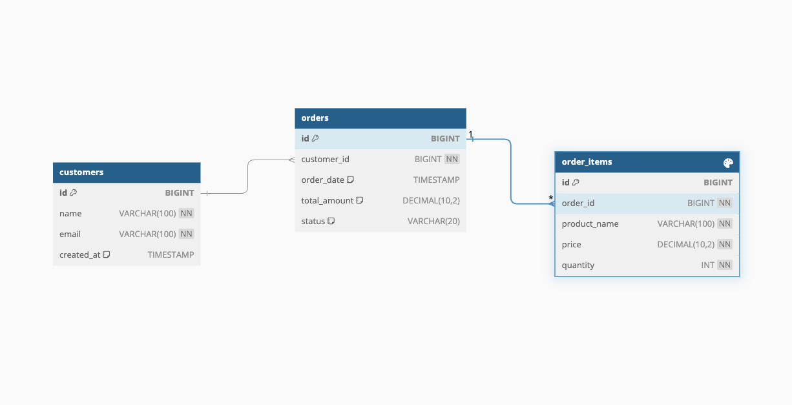

# Sistema de Gestión de Pedidos - TechShop Plus

## Introducción
TechShop Plus es una empresa emergente dedicada a la venta de productos tecnológicos que necesita modernizar su sistema de gestión de pedidos. Requieren una solución que les permita visualizar eficientemente el último pedido realizado por cada cliente junto con sus detalles.

## Objetivos del Proyecto
Desarrollar una aplicación web que permita:
- Visualizar el último pedido de cada cliente
- Ver el detalle completo de cada pedido
- Proporcionar una API REST para consultas específicas

## Requerimientos Técnicos
### Tecnologías Requeridas
- Spring Boot 3.2+
- MySQL 8.0+
- Thymeleaf
- Maven

### Dependencias Principales
```xml
<dependencies>
    <dependency>
        <groupId>org.springframework.boot</groupId>
        <artifactId>spring-boot-starter-web</artifactId>
    </dependency>
    <dependency>
        <groupId>org.springframework.boot</groupId>
        <artifactId>spring-boot-starter-data-jpa</artifactId>
    </dependency>
    <dependency>
        <groupId>org.springframework.boot</groupId>
        <artifactId>spring-boot-starter-thymeleaf</artifactId>
    </dependency>
    <dependency>
        <groupId>com.mysql</groupId>
        <artifactId>mysql-connector-j</artifactId>
        <scope>runtime</scope>
    </dependency>
</dependencies>
```

## Estructura del Proyecto




### 1. Modelo de Datos

1. **Cliente (Customer)**
   - id (Long)
   - name (String)
   - email (String)

2. **Pedido (Order)**
   - id (Long)
   - customer (Customer)
   - orderDate (LocalDateTime)
   - totalAmount (BigDecimal)

3. **Item de Pedido (OrderItem)**
   - id (Long)
   - order (Order)
   - productName (String)
   - price (BigDecimal)
   - quantity (Integer)

### 2. Desarrollo Frontend (Thymeleaf)

#### 2.1 Vistas Requeridas

1. **Dashboard Principal** (`/`)
   - Tabla de últimas órdenes por cliente que muestre:
     * Nombre del cliente
     * Número de orden
     * Fecha de la orden
     * Cantidad total de productos en la orden
     * Monto total pagado
   - La tabla debe incluir paginación
   - Cada fila debe tener un botón "Ver Detalle"

2. **Vista de Detalle de Orden** (`/orders/{id}`)
   - Accesible al hacer clic en el botón "Ver Detalle"
   - Debe mostrar:
     * Información de la orden:
       - Número de orden
       - Fecha de la orden
       - Cliente
       - Monto total
     * Tabla de productos que incluye:
       - Nombre del producto
       - Precio unitario
       - Cantidad
       - Subtotal por producto

### 3. API REST

#### 3.1 Endpoints Requeridos

```
# Obtener últimas órdenes por cliente (una por cliente)
GET /api/orders/latest
Response:
{
    "content": [
        {
            "orderId": 1,
            "customerName": "Juan Pérez",
            "orderDate": "2024-02-20T10:30:00",
            "totalItems": 3,
            "totalAmount": 1499.97
        }
    ],
    "totalPages": 5,
    "currentPage": 0,
    "pageSize": 10
}

# Obtener detalle de una orden específica
GET /api/orders/{id}/detail
Response:
{
    "orderId": 1,
    "orderDate": "2024-02-20T10:30:00",
    "customerName": "Juan Pérez",
    "totalAmount": 1499.97,
    "items": [
        {
            "productName": "Laptop Dell XPS 13",
            "price": 1299.99,
            "quantity": 1,
            "subtotal": 1299.99
        },
        {
            "productName": "Mouse Logitech MX",
            "price": 99.99,
            "quantity": 2,
            "subtotal": 199.98
        }
    ]
}
```

### 4. Consultas SQL Requeridas

Se solicita implementar las siguientes consultas SQL para obtener información específica del sistema:

1. **Análisis de Órdenes por Cliente**
   - Crear una consulta que muestre para cada cliente:
     * Nombre del cliente
     * Total de órdenes realizadas
     * Monto total de todas sus compras
     * Fecha de su primera y última orden
     * Promedio de productos por orden

2. **Top Productos Vendidos**
   - Desarrollar una consulta que muestre:
     * Nombre del producto
     * Cantidad total vendida
     * Número de órdenes diferentes en las que aparece
     * Precio promedio al que se ha vendido
     * Monto total generado
   - La consulta debe ordenar los resultados por monto total generado de manera descendente

3. **Análisis de Ventas por Periodo**
   - Implementar una consulta que muestre por mes:
     * Mes y año
     * Cantidad de órdenes
     * Número de clientes diferentes que compraron
     * Total de productos vendidos
     * Monto total de ventas
     * Comparación porcentual de ventas respecto al mes anterior

### 5. Tareas a Realizar

1. **Backend**
   - Implementar entidades JPA
   - Crear repositorios con consultas necesarias
   - Desarrollar servicios para la lógica de negocio
   - Implementar controladores REST y MVC

2. **Frontend**
   - Desarrollar plantilla del dashboard
   - Implementar vista de detalle
   - Agregar paginación en el dashboard
   - Manejar navegación entre vistas

3. **Base de Datos**
   - Crear esquema de base de datos
   - Implementar relaciones entre entidades
   - Generar datos de prueba

## Entregables
1. Código fuente del proyecto
2. Script SQL con estructura y datos de prueba
3. Documentación de la API
4. Manual de implementación